# KnowledgeTree

**One organigram per customer. Every entity owns its knowledge. Every change has a name.**

A proof of concept for the SD Worx hackathon challenge *Unlock the Knowledge Within: Find it. Understand it. Trust it.*

**Live demo:** https://knowledgetree-99869633039.europe-west1.run.app (pick any account on the login page, for example Lena Vermeulen)

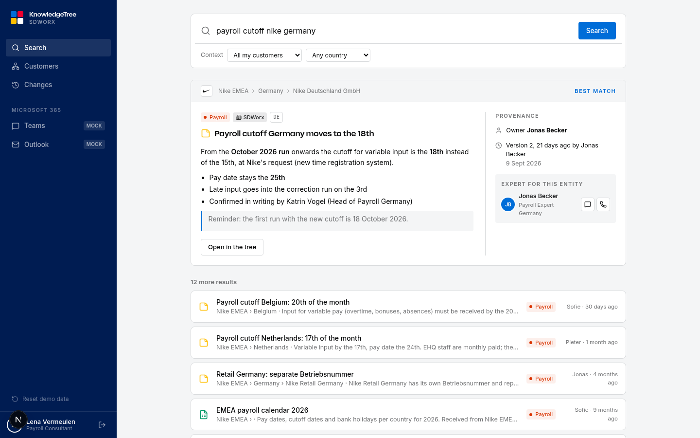

## The problem we picked

A payroll consultant at SD Worx works for several customers, each with entities in several countries. The knowledge about those customers is scattered: contracts in SharePoint, a payroll calendar in an email, the cutoff date in a Teams chat, the rest in the head of the colleague who is leaving. When a customer asks an urgent question, the consultant finds three versions of the answer and cannot tell which one is current, who changed it, or whether it even applies to this country.

Two moments of doubt from the challenge brief guided us:

- **The urgent question.** "Nike Germany asks what the payroll cutoff is, they heard it changed." Which document is right?
- **The client handover.** A consultant inherits a portfolio and has to rebuild the picture from folders, threads and people.

## Our idea

Instead of searching a pile of documents, we give every customer a **living organigram**: group, countries, legal entities. Every entity in that tree owns its own knowledge, so a fact always lives in exactly one place: the place it applies to.

Three rules make the knowledge trustworthy by construction, without a "trust score":

1. **Fixed shelves everywhere.** A customer subscribes to SD Worx products (Payroll, Time & Attendance, HR Administration, Legal & Compliance, Reporting, Contract & SLA). Every entity of that customer automatically carries the same product categories, even when empty. Nike Belgium and Nike Germany always have the same shelves, so nothing can hide in a random folder.
2. **Our documents and their documents are separate.** In every category, documents created by SD Worx are kept apart from documents received from the customer. What the customer sent is stored as received; what we wrote is versioned by us.
3. **Every change has a name.** Each file and note has an owner, a version history with a reason per version, and an audit trail. Outdated items are archived, never deleted, so history stays visible instead of competing with the current answer.

Around the tree we added the two things a consultant actually uses all day: a **search prompt** that answers with the entity, owner and version of the fact, and **capture from Teams and Outlook**, so knowledge leaves the inbox the moment it is created.

## What we built

A working web portal plus mock-ups of the Microsoft 365 integrations, all backed by the same data.

### Sign in and see only your customers

People only see the customers they are assigned to. Search, the tree, the Teams bot and the Outlook add-in all respect that, so the tree also protects customer data.

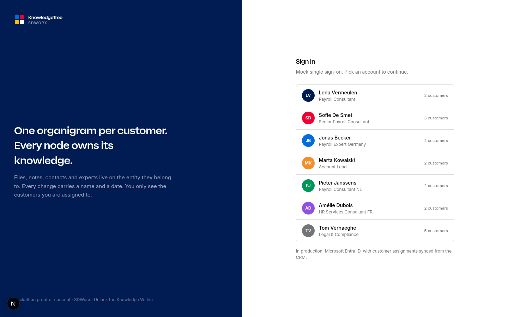

### Ask a question, get the fact with its provenance

The home page is a search prompt over your customers. The best match shows the entity it belongs to, the category, whether it is an SD Worx or a customer document, the owner, the version and the expert to call.

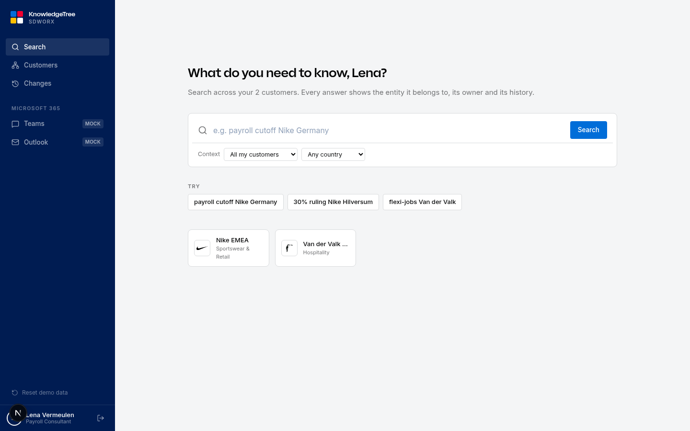

### Your customers

Customers with their products, countries, account lead and last change. Searchable and filterable.

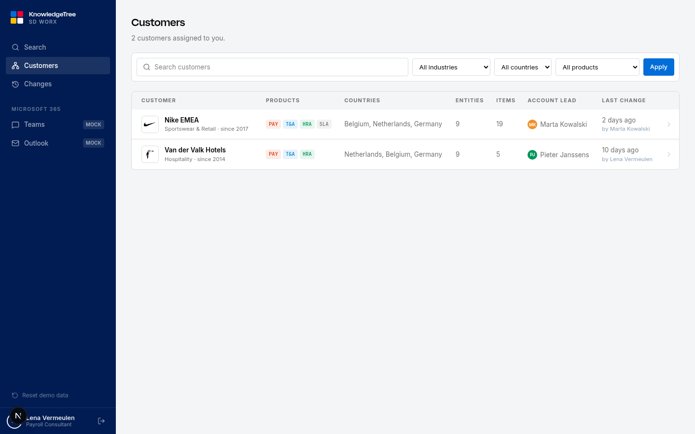

### The organigram

Every entity card shows the fixed product categories with item counts, how many documents came from the customer, and what it inherits from parent entities (a group agreement applies to every country below it). Click an entity and the view zooms in and unfolds its product nodes.

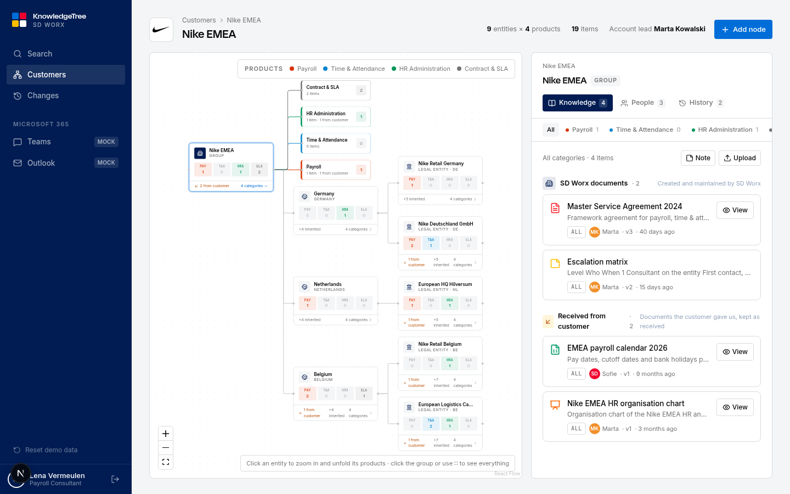

### An entity, one product, two kinds of documents

Nike Deutschland GmbH › Payroll: SD Worx notes on top, the Lohnsteuer registration received from the customer below. The note about the new cutoff renders as formatted text with its owner, origin, topic and full version history.

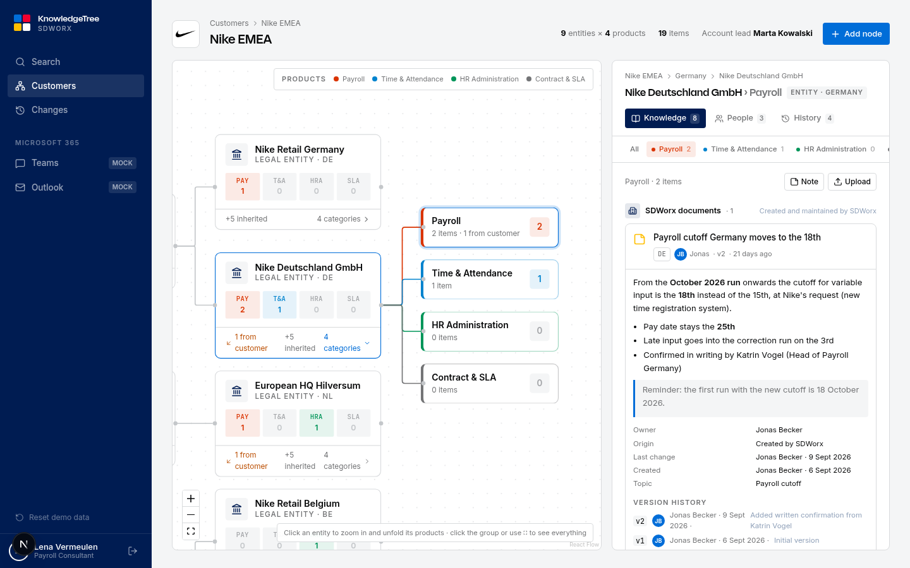

### Real documents: view and download

Every document opens in the portal (PDF, Excel and Word, with a PDF preview for Office files) and can be downloaded in its original format. New documents are uploaded from the same panel and get a new version each time a newer file is uploaded.

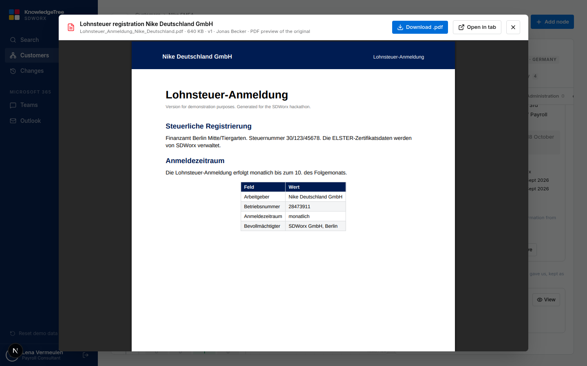

### Notes with a proper editor

Notes are written in a full-screen markdown editor with a toolbar and live preview. Saving asks for a reason, which lands in the version history.

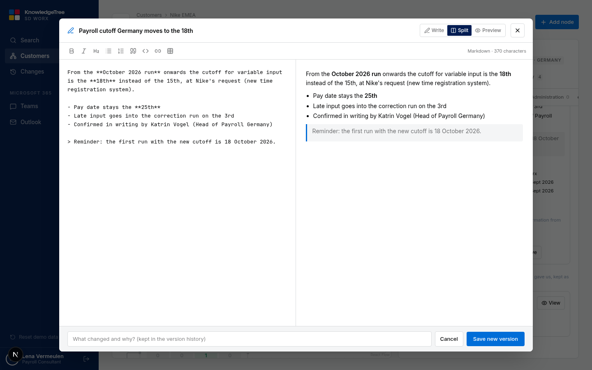

### Capture from Teams

On any Teams message, "Save to KnowledgeTree" detects the customer, the entity and the product category, and stores the message on the right node with a link back to the chat. Mentioning @KnowledgeTree asks the tree a question and gets the current fact with owner and version.

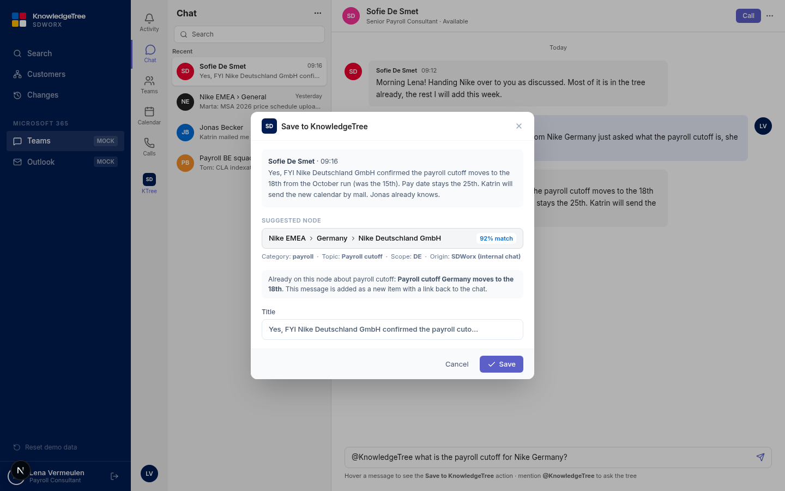

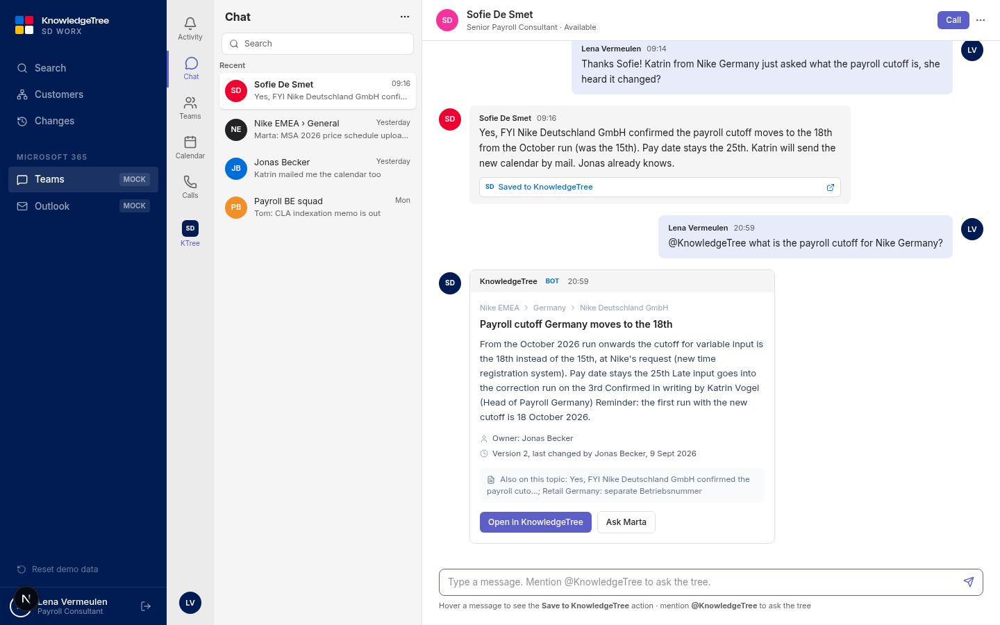

### Capture from Outlook

The add-in recognises the customer entity from the sender and the content, shows what the tree already knows, and files the attachment or the email to that entity as a document received from the customer.

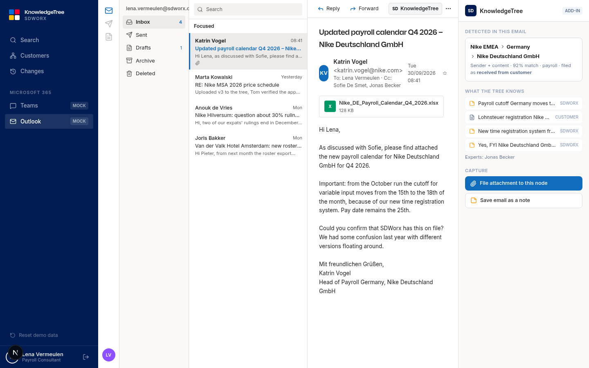

### Changes

Everything that changed on your customers, newest first, with a name on every line. Filter by customer or show only your own changes.

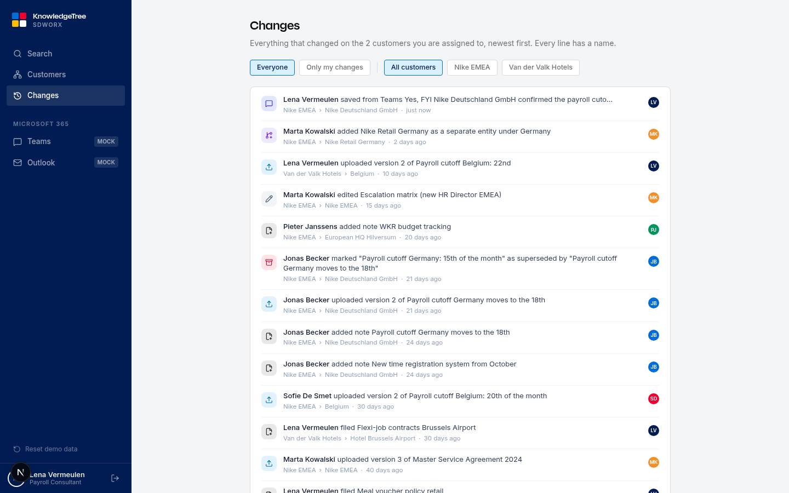

## The 3-minute demo

1. **Sign in** as Lena. She sees Nike EMEA and Van der Valk Hotels only.
2. **Ask** "payroll cutoff Nike Germany". The answer shows Nike Deutschland GmbH › Payroll, owner Jonas, version 2, and the expert to call.
3. **Open the tree.** Click Nike Deutschland GmbH, then Payroll. View the Lohnsteuer document received from the customer, open the cutoff note, edit it in the editor with a reason. Version 3 appears under Lena's name; the old "15th" note sits under Archived.
4. **Teams.** Save Sofie's message to the tree, then ask @KnowledgeTree the question.
5. **Outlook.** File Katrin Vogel's new payroll calendar to the same entity.
6. **Changes.** The whole session, with Lena's name on every line. Sign in as Amélie: Nike is gone.

## What is real and what is mocked

| Part | In this proof of concept | Production path |
| --- | --- | --- |
| Portal (search, customers, organigram, documents, notes, versions, history, access) | Fully working | Postgres or Firestore, files in Cloud Storage or SharePoint |
| Login | Mock single sign-on with an access list per person | Microsoft Entra ID, assignments from the CRM |
| Documents | Real generated PDF, Excel and Word files; real uploads | Connect to SharePoint / Graph API |
| Node and category detection for chats and emails | Rule-based on customer name, country and topic | LLM pass for entity, scope and topic |
| Teams message action and bot | Mock Teams client inside the portal, calling the real backend | Teams message extension and Bot Framework app |
| Outlook add-in | Mock Outlook inside the portal, calling the real backend | Office add-in manifest, Graph API for attachments |

## Team

VIVES student team for the SD Worx hackathon 2026.

---

## Technical details

### Run locally

```bash
pnpm install
pnpm dev
# open http://localhost:3000 and pick an account
```

Data lives in `data/db.json`, created from the seed on first start. **Reset demo data** in the sidebar restores the seed. Uploads land in `data/uploads`.

### Stack

Next.js 16 (App Router, server actions, route handlers), React 19, Tailwind 4, React Flow with dagre for the organigram, react-markdown for notes. Branding follows the SD Worx Ignite design system (cdn.sdworx.com/ignite): primary blue #006dd8, dark navy #001c52, logo red and yellow, Inter for body text and SD Worx Display for headings. Tokens are in `src/app/globals.css`, the product catalog in `src/lib/catalog.ts`.

### Project layout

| Path | What |
| --- | --- |
| `src/app` | Pages: search (`/`), customers, customer tree, changes, login, Teams and Outlook mock-ups, file API |
| `src/components` | Organigram, node panel, document viewer, note editor, mock-ups |
| `src/lib` | Data model, seed, JSON store, search, node detection, server actions, auth |
| `public/files` | Generated demo documents (PDF, XLSX, DOCX) and their PDF previews |
| `public/logos` | Customer logos |
| `scripts/generate_files.py` | Regenerates the demo documents (needs Python with reportlab and openpyxl, plus LibreOffice) |
| `docs/screenshots` | The images in this README |

### Deploy on Google Cloud (Cloud Run)

The app ships as one container (`Dockerfile`, Next.js standalone build). Cloud Run builds it from source and returns a public HTTPS URL.

```bash
gcloud auth login
gcloud config set project YOUR_PROJECT_ID
gcloud services enable run.googleapis.com cloudbuild.googleapis.com artifactregistry.googleapis.com

gcloud run deploy knowledgetree \
  --source . \
  --region europe-west1 \
  --allow-unauthenticated \
  --memory 1Gi \
  --min-instances 1
```

Re-run the same command to redeploy. `--min-instances 1` keeps one instance warm for the pitch. Data and uploads live inside the container, so they reset when Cloud Run replaces the instance; press **Reset demo data** before the demo. Local container check: `pnpm docker:build` then `pnpm docker:run` (http://localhost:8080).
